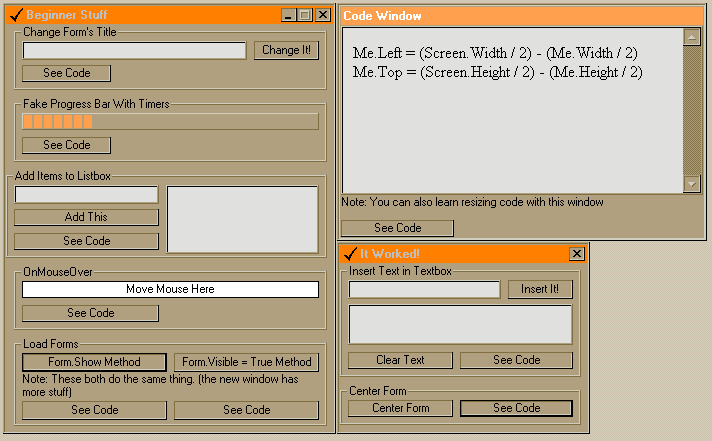



## A \!\! VB Beginner Stuff \!\!

### Description

This will help the beginning programmer with some basic stuff. Has a Code Window to view the code for the current item in a webbrowser control. Shows how to change Title (caption), onmouseover effects, progress bar stuff, centering forms, resizing form and contents, adding items to listbox, inserting text, etc. Tell me what you think about it.
 
### More Info
 

             |
---                |---
**Submitted On**   |2001-08-16 09:14:20
**By**             |[Ryan Olson \- OLSONAMI](https://github.com/Planet-Source-Code/PSCIndex/blob/master/ByAuthor/ryan-olson-olsonami.md)
**Level**          |Beginner
**User Rating**    |4.2 (50 globes from 12 users)
**Compatibility**  |VB 5\.0, VB 6\.0
**Category**       |[Miscellaneous](https://github.com/Planet-Source-Code/PSCIndex/blob/master/ByCategory/miscellaneous__1-1.md)
**World**          |[Visual Basic](https://github.com/Planet-Source-Code/PSCIndex/blob/master/ByWorld/visual-basic.md)
**Archive File**   |[A \!\! VB Be247958162001\.zip](https://github.com/Planet-Source-Code/ryan-olson-olsonami-a-vb-beginner-stuff__1-26288/archive/master.zip)

